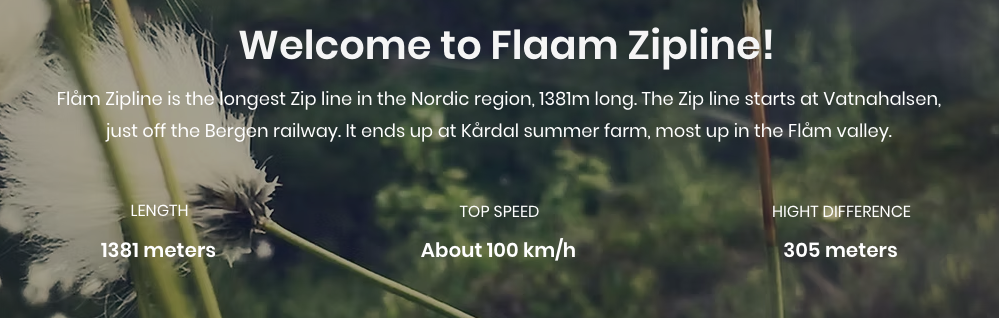

# "Hihglight"-ok 
Az alabbi nagy highlightok kozul max 2 megcsinlahato, attol fugg milyen kombinacioban persze(legeszakibb meg legdelibb nem jo pl kombinalva).
Szoval errol irok ki egy szavazast mindenki dontse el mit szeretne inkabb. Valamelyikeknel leszeknek "sub highlightok", ezek olyanok hogy akkor tudjuk megcsinalni ha az adott highlight volt valasztva mert ahhoz van kozel.

### 1. Preikestolen (Szoszek szikla, vagy Pulpit rock)
Ez egy relative easy turaval megkozelitheto, kilogo szikla, asszem olyan ~600 metert maszik az ember. Maga a szikla kilog a fjord fele ami tengerszint ugye, szoval gyakorlatilag egy 600 meteres urrre latsz ra. Del-nyugat Norvegia talan legnepszerubb turistacelpontja.
##### plusz dolgok kozelben
- Stavangerben szerintem barmi program talalhato
- ott a Lysefjord, azon vannak cruisok meg millio tura korulotte
##### sub highlights
- Kjeragbolten (Kjerag szikla) - Ez egy kis ko beszorulva ket hegyfal koze amire ra lehet allni, eleg random, de nagyon jo foto lehetoseg. 
- Stavanger: Cuki relative deli varos, egyik legszebbnek mondja Norvegiaban (pusztan varos skalan), en meg nem voltam, de jokat hallottam.
- Honorable mention: Brokke badeplass, ha jo ido van ez egy ilyen kis erdei to, vannak ilyen termeszetes "csuszdak", ahol a nagy kobe vasott utat a patak es abban lehet csuszni, kicsit messzebb
##### links
- https://www.visitnorway.com/places-to-go/fjord-norway/ryfylke/the-lysefjord-area/hiking-to-preikestolen/
- https://www.visitnorway.com/places-to-go/fjord-norway/ryfylke/the-lysefjord-area/hiking-to-kjerag/
- https://www.youtube.com/watch?v=35h0-XbQFZQ

### 2. Gaustatoppen
1,830 meter magas hegycsucs, jo idoben 1/6oda egesz Norvegianak latszik, kb 3 oras medium tura visz fel, optcionalisan fel lehet jutni az alagutvasuttal is (reszlet kesobb). Van kis gofris/kajas a csucson.
##### plusz dolgok kozelben:
- A Gaustaban van egy alagutvasut, ami felvisz a hegy tetejere. Ez egy hideg haborus titkos NATO letesitmeny volt, amit 2010ben kinyitottak nyilvanosan, es lehet hasznalni.
- Van egy tobb hegybol allo siparadicsom, szoval sokminden program van a kozelben
- floating sauna, ebbol egybol a toba lehet ugrani (marmint azon floatol ertelemszeruen)
- hegyi kabinok, grill
- SUP, csonak stb berles
- Sok hegy miatt rengeteg tura
- bunji jumping egy ilyen gat szeru valamirol (nagyon limited availablity meg kell nezni ha nagyon akatjuk elore)
##### sub highlights
Itt az annyira nincs, inkabb csak az activityk kozveteln mellette
##### links:
- https://www.visitnorway.com/things-to-do/outdoor-activities/hiking/gaustatoppen/
- https://gaustabanen.no/en/
- https://www.visitnorway.com/listings/floating-saunas-at-gausta/207968/
- https://www.gausta.com/en-US/things-to-do/
- https://www.telemark-opplevelser.no/strikkhopping

### 3. Loen skylift
Laza 1km elevationt nyom 5 perc alatt fjordtol a hegycsucsra (1011m). Innen kis turaval van kilato etterem stb fent, meg nyilvan nagyon fasza kilatas.
##### plusz dolgok kozelben: 
- Van egy gleccser a kozelben amivel egyszeru kis turaval fel lehet libbenni
- Maga a skylift kornyeke amugy egy komplexum van sokminden
- Zip line a hegyoldalban
- nyilvan csomo turautvonal fel, vagy mar a lift tetejerol indulva
- csonak / vizibickli berles lent a fjordon
##### sub highlights
- Briksdalsbreen gleccser, hangulatos egyszeru kis turautvonal. belefer boven egy napba a Loen-nel egyutt is
##### links
- https://en.loenskylift.no/about-loen-skylift
- https://www.visitnorway.nl/listings/hiking-to-briksdalsbreen-glacier/212792/

### 4. Rallarvegen bicikliut / zipline
Ez egy kb egesznapos bicikliut, ilyen soderes terepen berelt bicajjal. Az egesz ugy van kitalalva hogy fixen erre az utvonalra, szoval kezdoponton vesszuk fel a bicot es a vegponton kell leadni, nem kell a visszavitellel agodnunk. Ilyen kisvasut szeru valami megy vissza a kezdopontra, az amugy is turistaerteku. A linken reszletesen le van irva, ez nagyreszben lefele megy emelkedo nelkul, ugy nezzetek hogy "Finse"-bol es "Vatnahalsen"-ig biztos. Ez egy 36km-es szakasz. Onnan ket opcio van (szerintem itt oszlas is lehetseges, szoval hogy fele tarsasag ez fele az, szoval ha barmelyik opcio szimpi csak akkor is nyugodtan lehet erre szavazni):
- Lebiciklizzuk a maradek 16km-t Flam-ig
- Felszallunk a ziplinera amivel leveretjuk Flamba
    
    bicokat leviszik lifttel az a jegybe beletartozik
##### plusz dolgok a kozelben
Igazabol a bicout melletti mindenfele kiletopontok, megallok ilyesmi szokasos.
##### sub highlights
**_NOTE:_** Ez egy rendhagyobb pont, mert elhelyezkedesben kozel van, magaba Flam varosba mindenkepp megyunk, mert nagyon extra es mint mondtam nem esik ki. Ennel a kerdes az, hogy kimondottan ezt a progit akarjuk e, mert habar helyileg kozel van, de ez egesz napos progi akarhogy nezem. Viszont egesz biztosan rendhagyo. Igy ez a resz most ures, mert nem ezen program kivalasztasatol fugg a megnezesuk.
##### links
- https://www.haugastol.no/en/rallarvegen
- https://en.flamsbana.no/rallarvegen
- https://booking.hotelfinse1222.no/extras/d31a9435-4d00-45ca-a919-95fbaa8fd3f0?channelid=259222bd-34e7-4fcd-bc75-29a239035ad8&langid=2

### 5. Honorable mentions 
##### Glacier Tours
Ezt igazabol most talaltam random az elozo pont irasa kozben, ugyhogy nem nagyon olvastam utana meg. Ugyanott van mint a 4-es pont, ugyanugy egy egesz napos mokanak tunik. A hotellel egybekotott dealt talaltam csak itt meg, nem tudom van e kulon is vagy az mennyi https://www.haugastol.no/en/glacier-tours#turdetaljer
##### Tura Oyvinddel 
Engem vitt mar el ott a kornyeken olyan turara nem egyszer amin egyedul fixel nem talaltam volna el. Megkertem mar hogy kuldjon olyat amit ajanl, de ha van kedvetek szivesen megkerdeznem lenne e kedve csatlakozni is egyik nap, szerintem annal autentikusabban nem tudkjuk megnezni a kornyeket. Ez nem feltetlen egesz napos, de nyilvan akkor nem rohannank, szoval kb ez a tradeoff, hogy lehet klasszik "turistacelpontokbol" egyel mondjuk kevesebbet latunk, de letolunk egy olyat aminek igazi norveg turaerteke van, illetve egy turista valoszinuleg soha nem jut el. Ezt elozo szavazastol fuggetlen kiirom kulon, nem fugg annyira ossze

# Tudnivalok
Erkezes penteken napkozben, szoval en ott aznapra mar ugy keszulnek, hogy setalos szett, valami kis tura szeruhoz ruha legyen elol, valoszinuleg inkabb varosnezos, kis setas nap, valamennyi vezetessel mar azert, hogy az ne az elso teljes napbol menjen. Reszleteket beszeljuk ha az utvonalas szavazas eldolt.

Indulas szerdan szinten napkozben, itt abszolut az van tervben hogy ha valamennyivel messzebb is vagyunk (fixen nem sokkal azert hogy tuti legyen) csak varoshoz vezetes, Bergenben boven el lehet hesszelni gyonyoru varos amugy szerintem.

### Ami biztosan kell
- Szemelyi, ertelemszeruen
- Azert relative meleg valami reteg, megha mondjuk turazasnal melegunk is van csak kiulni meg ilyesmi.
- Vizallo dzseki/kabat/kutyafasza, ertelemszeruen
- Jo cipo, turacipo, de masszivabb nem teljesen lapostalpu cipo is megteszi ha valaki nem akar csak azert venni cipot. **Legyen vizallo**
- Eloszor javasoltnak akartam irni, de faszt meggondoltam magam: vizallo nadrag is, sajnos nem tudjuk az idojarast kiszamitani, ha esik ott esik, az pillanatok alatt kegyetlen vizes leszel. Nem kell tulgondolni, [egy ilyen tokeletes](https://www.decathlon.nl/sporten/wandelen/wandelbroek-heren?pdt-highlight=345947&vc=c382m8796550&utm_source=google&utm_medium=cpc&utm_campaign=nl_t-perf_ct-shopp_n-branded_ts-bra_f-cv_o-roas_pt-pb_&utm_agid=140428463263&utm_term=&gad_source=1&gad_campaignid=18452298410&gbraid=0AAAAADRRZp0gy4AICa6HrMY53ej4SkDQ-&gclid=Cj0KCQjw7eXTBhDBARIsAKF-w46_CkD4qOvUyPbog1nc5q6l296F7mrYjjEMDmvsOuAKwNcPRaElnw0aApbQEALw_wcB)en megfelel a celnak, es akkor lehet kenyelmesen turara oltozni de megis vedve maradni.
- Furdogatya, ha esetleg valahogy szerencsenk van, akkor mivel viz mindenhol van, barhol vagyunk epp fix lehet furdeni, kis helyet foglal.

### Ami biztosan nem kell
- Utlevel, szemelyi eleg a be/ki utazashoz (Dancs ertelemszeruen kivetel)
- Torulkozo, ebbol van anyueknak rengetek tudok hozni eleget lesz mindnenkinek. Foleg a wizzairrel erkezoknek koltsetek masra az ertekes kis helyet
- Tusfurdo, fogkrem, etc: ezt is tudunk mind kerni, amugy se lehet repulore vinni, szoval ezen se aggodjatok. Ha barmi kerdeses ilyen kell-e kerdezz
- Papucs targyalas alatt, van valamennyi plusz, ha valaki nagyon szeretne a sajatjat hozza de amugy van ra esely tudunk valamennyit adni. Ha kardinalis kerdes kicsivel utazas elott kerdezz ra es megbeszeljuk! (update anyutol valszeg lesz)
- Norveg korona. Szinte mindenhol van kartya, ha esetleg valahol nincs is mert ilyen becsuletkasszas wc ilyesmi, 99,9%-ban van vipps ami ilyen cashapp szeru cuccuk, szolok anyunak es nekik van. Valamint ha megis kene apro cagy tenlyeges kp, kerek elotte szinten hogy legyen nalunk valamennyi, de valoszinutlen. Ne baszakodjatok valtassal, en se teszem.