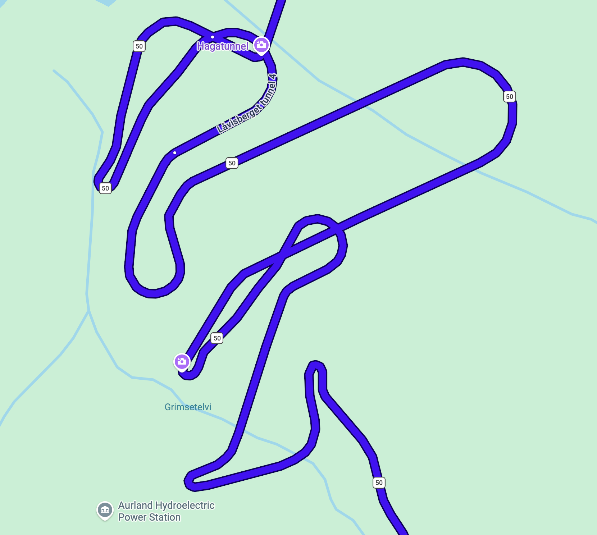

# Ez az oldal
Na vegre egy doksi amit nem kovet szavazas, gondolhatjatok. Ezt az oldalt azert gondoltam hogy meg legyen minden egy helyen, egyszeruen elerheto helyen, barki szamara. Szoval ha felmerul a kerdes, ohh hogy is volt X meg Y, akkor egy klikkel minden elerheto, barhonnan barkinek.

# Tudnivalok
## Hasznos dolgok utazas elott.
- [Turaterkepek](https://apps.apple.com/nl/app/norgeskart-friluftsliv/id1350671128?l=en-GB)
- [Idojaras app](https://apps.apple.com/nl/app/yr-no/id490989206?l=en-GB)
- [Potencialisan olcso kaja](https://apps.apple.com/nl/app/too-good-to-go-save-good-food/id1060683933?l=en-GB), ez mondjuk ha jol gondolom nekem meg Mariknak meg van szoval az eleg is, de ha valaki akarja nezegetni.

## Ami biztosan kell
- Szemelyi, ertelemszeruen
- Egy embernel jogsi legalabb
- Azert relative meleg valami reteg, megha mondjuk turazasnal melegunk is van csak kiulni meg ilyesmi.
- Vizallo dzseki/kabat/kutyafasza, ertelemszeruen
- Jo cipo, turacipo, de masszivabb nem teljesen lapostalpu cipo is megteszi ha valaki nem akar csak azert venni cipot. **Legyen vizallo**
- Eloszor javasoltnak akartam irni, de faszt meggondoltam magam: vizallo nadrag is, sajnos nem tudjuk az idojarast kiszamitani, ha esik ott esik, az pillanatok alatt kegyetlen vizes leszel. Nem kell tulgondolni, [egy ilyen tokeletes](https://www.decathlon.nl/sporten/wandelen/wandelbroek-heren?pdt-highlight=345947&vc=c382m8796550&utm_source=google&utm_medium=cpc&utm_campaign=nl_t-perf_ct-shopp_n-branded_ts-bra_f-cv_o-roas_pt-pb_&utm_agid=140428463263&utm_term=&gad_source=1&gad_campaignid=18452298410&gbraid=0AAAAADRRZp0gy4AICa6HrMY53ej4SkDQ-&gclid=Cj0KCQjw7eXTBhDBARIsAKF-w46_CkD4qOvUyPbog1nc5q6l296F7mrYjjEMDmvsOuAKwNcPRaElnw0aApbQEALw_wcB)en megfelel a celnak, es akkor lehet kenyelmesen turara oltozni de megis vedve maradni.
- Furdogatya, mindekepp hosz szaunazunk is.
- Nezzetek az idojarast, a magasabb turaspotokon lehet azert eleg huvos.

## Ami biztosan nem kell
- Utlevel, szemelyi eleg a be/ki utazashoz (Dancs ertelemszeruen kivetel)
- Torulkozo, ebbol van anyueknak rengetek tudok hozni eleget lesz mindnenkinek. Foleg a wizzairrel erkezoknek koltsetek masra az ertekes kis helyet
- Tusfurdo, fogkrem, etc: ezt is tudunk mind kerni, amugy se lehet repulore vinni, szoval ezen se aggodjatok. Ha barmi kerdeses ilyen kell-e kerdezz
- Papucs ugy nez ki megoldhato szinten
- Norveg korona. Szinte mindenhol van kartya, ha esetleg valahol nincs is mert ilyen becsuletkasszas wc ilyesmi, 99,9%-ban van vipps ami ilyen cashapp szeru cuccuk, szolok anyunak es nekik van. Valamint ha megis kene apro cagy tenlyeges kp, kerek elotte szinten hogy legyen nalunk valamennyi, de valoszinutlen. Ne baszakodjatok valtassal, en se teszem.

# Haditerv
## Pentek
[BGO -> Steinsdalsfossen -> Låtefossen -> Røldal Accommodation](https://www.google.com/maps/dir/Bergeni+rep%C3%BCl%C5%91t%C3%A9r,+Flyplassvegen+555,+5258+Bergen,+Norv%C3%A9gia/Steinsdalsfossen,+Mo+ved+Steinsdalen,+5600+Norheimsund,+Norv%C3%A9gia/L%C3%A5tefossen,+L%C3%A5tefossbrua+5763,+5763+Skare,+Norv%C3%A9gia/R%C3%B8ldal+Accommodation,+Haukelivegen+66,+5760+R%C3%B8ldal,+Norv%C3%A9gia/@59.9250165,6.0613474,9.99z/data=!4m26!4m25!1m5!1m1!1s0x463cf077ebbd99cd:0xec6823fbf8790!2m2!1d5.2219012!2d60.2938358!1m5!1m1!1s0x463c343534cc79d7:0xcfbdfe770adfa0d7!2m2!1d6.1030028!2d60.3708694!1m5!1m1!1s0x463ea6ce0dde1473:0x16e9f7f1d0bd1bae!2m2!1d6.5840554!2d59.9480693!1m5!1m1!1s0x463eb08858069819:0xae98540de15c2ad6!2m2!1d6.821952!2d59.8355093!3e0?entry=ttu&g_ep=EgoyMDI2MDgxMi4wIKXMDSoASAFQAw%3D%3D)

#### Szabad program:
- [Låtefoss](https://www.visitnorway.nl/listings/latefoss-waterfall/14047/)
- [Steinsdalsfossen](https://www.visitnorway.nl/listings/steinsdalsfossen-waterfall/14039/)

#### Foglalando program:
-

#### Lefoglalt dolgok
- [Røldal Accommodation](https://www.airbnb.com/l/fHZ4xyA9?s=67&unique_share_id=a24a8de5-f6dc-48c5-a34b-c6df55e2950c)

## Szombat
[Røldal Accommodation -> Gaustatoppen](https://www.google.com/maps/dir/R%C3%B8ldal+Accommodation,+Haukelivegen+66,+5760+R%C3%B8ldal,+Norv%C3%A9gia/Gaustatoppen,+3660+Rjukan,+Norv%C3%A9gia/@59.8236597,8.4893693,11.95z/data=!4m14!4m13!1m5!1m1!1s0x463eb08858069819:0xae98540de15c2ad6!2m2!1d6.821952!2d59.8355093!1m5!1m1!1s0x463f5ebc39ff7559:0xaa74e48aa42fb8e3!2m2!1d8.649171!2d59.8542133!3e0?entry=ttu&g_ep=EgoyMDI2MDgxMi4wIKXMDSoASAFQAw%3D%3D)

**Note:** Itt be kell majd vasarolnunk ugy hogy masnap utra is legyen, mert masnap nem lesznek nyitva a boltok. Sot, mivel reggel koran megyunk biciklizni, en azt mondom jobban at kell gondolnunk, es bevasarloni a bicikliturara is.

#### Szabad program
- [Rijukanfossen](https://www.visitnorway.nl/listings/rjukanfossen/14262/)
- [Vidsyn - Masken på Vierli](https://www.visitnorway.com/listings/sculpture-hike-vidsyn-oksatjonn/237526/)
- [Den gamle Haukelivegen (Scenic road)](https://evendo.com/locations/norway/telemark/attraction/turistveg-den-gamle-haukelivegen-scenic-road) ez utba esik az egyik alagut helyett korbe tudunk menni

#### Foglalando program
- [Gaustabanen](https://gaustabanen.no/en) Van helyszini jegypenztarjuk is szoval ezt szerintem majd ott kitalaljuk hogy le/fel/midnketto/egyiksem hogy szeretnenk vele menni, ezt felesleges elore foglalni
- [Shuffleboard](https://booking.gausta.com/en/to-do/2867223/shuffleboard-p%c3%a5-gaustablikk-fjellresort/showdetails?_gl=1*12sqglq*_gcl_au*MTAxNjkxNzQyNS4xNzg2ODY3NTk4Ljc4Mzk2MTc5NC4xNzg2ODY3NzYzLjE3ODY4Njc4MTMuMTA3MDkyNDAzMC4xNzg2ODY3NzYzLjE3ODY4Njc4NDA.*_ga*MzE0MTM0MDIuMTc4Njg2NzU5Nw..*_ga_DCWSNVS8F7*czE3ODY4ODY4NTQkbzIkZzEkdDE3ODY4ODY5MzkkajQ5JGwwJGgxMjg5MTkyOTc5) Ez eleg nagyot megy ugyhogy akar ki is probalhatjuk, de ketlem hogy akkora tolongas lenne ra hogy elfogyjanak a palyak

#### Lefoglalt dolgok
- [Kvitåvatn Fjellstue](https://assets.kak.im/assets/pdf/Kvitavatn-Fjellstue.pdf)
- [Floating sauna](https://doc.citybreak.com/createpdf.aspx?ticket={7be97aaa-d4c1-471f-9ac8-fc1e05f3a535}&contextid=63591&Confirm=1&cnew=1&type=HTML) Ezt egy orara foglaltam csak, mert tenyleg koknretan egy sauna a vegeben a molonak meg a to. gondolkodtam a ket oran, mert egyebkent arban szerintem nem veszes, nem tudom hogy ha a ket opcio a szauna vagy a 10 fokos viz akkor abbol le tudunk e nyomni 2 orat. Elvileg az orara utana szabad volt ha esetleg a 2t megszavazzuk.

## Vasarnap
[Gausta -> Flam](https://www.google.com/maps/dir/Gaustatoppen,+3660+Rjukan,+Norv%C3%A9gia/Fl%C3%A5m,+5743,+Norv%C3%A9gia/@60.3667719,7.3116684,9z/data=!3m1!4b1!4m14!4m13!1m5!1m1!1s0x463f5ebc39ff7559:0xaa74e48aa42fb8e3!2m2!1d8.649171!2d59.8542133!1m5!1m1!1s0x463e13cfcfc357c3:0x33286ff6aad510c5!2m2!1d7.1117849!2d60.8607716!3e0?entry=ttu&g_ep=EgoyMDI2MDgxMS4wIKXMDSoASAFQAw%3D%3D)

#### Szabad program
- [Stegastein](https://www.visitnorway.nl/listings/stegastein-viewpoint/245683/) Ez megkozelitheto kocsival, van parkolo mellette
- [Mount Prest hike](https://www.visitnorway.nl/listings/hike-to-prest-aurland/233793/) Ez viszont hike
- [World's longest tunnel](https://www.visitnorway.nl/listings/laerdalstunnelen-worlds-longest-road-tunnel/121166/) - ezen alavetoen nem mennenk at, de a bejaratanal elmegyunk
- [Ægir brewery](https://www.aegirbryggeri.no/om-aegir_2/) Vannak soreik, meg hires "Viking" menujuk. Valoszinuleg az vagyon, viszont csak soroket kostolni megoldhato. (Van ciderjuk is)
- Sajnos nem opcionalis: 

#### Foglalando dolgok
- [Shuttle bus](https://www.norwaysbest.com/en/flam/things-to-do/shuttlebus-flam-aurland) Shuttle Flam varosba a szallastol, ezt en szivesen fogadnam, mert ugyananny ido mint kocsival, viszont a fent emlitett brewery az nagyon jo, par seritalt szivesen elfogyasztanek. Most fel ora mulvara meg tudtam volna 6 jegyet venni, ugyhogy valoszinlueg nem surgos aznap is tudunk donteni.
- [Flam safari](https://book.flamsbrygga.no/en/book/to-do/1259827/fjordsafari/showdetails) 1,5-as hajos tura a kozeli fjordokon, megnezni vizeseseket meg olyan dolgokat amik csak a vizrol lathatoak. 

#### Lefoglalt dolgok
- [Winjum Apartments](https://assets.kak.im/assets/pdf/Winjum-Apartments.pdf)

## Hetfo
[Flam -> Finse](https://www.google.com/maps/dir/Fl%C3%A5m,+5743,+Norv%C3%A9gia/Finse,+5719,+Norv%C3%A9gia/@60.7320178,7.1368146,11z/data=!4m18!4m17!1m5!1m1!1s0x463e13cfcfc357c3:0x33286ff6aad510c5!2m2!1d7.1117849!2d60.8607716!1m5!1m1!1s0x463e45a0b112e965:0x2cac1126ada53331!2m2!1d7.5087455!2d60.600922!2m3!6e0!7e2!8j1787554800!3e3?entry=ttu&g_ep=EgoyMDI2MDgxMi4wIKXMDSoASAFQAw%3D%3D) -> Biciklitura -> [Flam -> Voss](https://www.google.com/maps/dir/Fl%C3%A5m,+5743,+Norv%C3%A9gia/60.6546669,6.4199575/@60.7733919,6.6010599,11z/data=!3m1!4b1!4m10!4m9!1m5!1m1!1s0x463e13cfcfc357c3:0x33286ff6aad510c5!2m2!1d7.1117849!2d60.8607716!1m1!4e1!3e0?entry=ttu&g_ep=EgoyMDI2MDgxMi4wIKXMDSoASAFQAw%3D%3D)

#### Szabad program
- [Bordalsgjelet szoros](https://www.visitnorway.nl/listings/bordalsgjelet-gorge/213249/)
- [Voss gondola](https://www.visitvoss.no/en/voss-gondol) Kell jegy de szerintem foglalni nem, amugy is a hegyen leszunk majd meglatjuk ezt utbaejtjuk e

#### Foglalando dolgok
-

#### Lefoglalt dolgok
- *Home in Voss* Pending - meg vissza kell igazolni
- *Flam zipline*: Pending - ha megvolt a szavazas tudom foglalni
- [Hotel 1222 rental](https://booking.hotelfinse1222.no/booking-confirmation?channelid=259222bd-34e7-4fcd-bc75-29a239035ad8&bookingguid=a19cbd51-11e8-4bb0-9b60-ab949eb89d80&bookingcode=HH15VX10ID)

## Kedd
[Voss -> Froyset](https://www.google.com/maps/dir/60.6544788,6.4199246/Fr%C3%B8yset,+5986+Hosteland,+Norv%C3%A9gia/@60.839573,5.6126971,10.12z/data=!4m9!4m8!1m0!1m5!1m1!1s0x463d6d2879c60fcd:0x56ed330cef465237!2m2!1d5.2139243!2d60.8644986!3e0?entry=ttu&g_ep=EgoyMDI2MDgxMi4wIKXMDSoASAFQAw%3D%3D)

#### Szabad program
- Idotol fuggoen a tura Oyvniddel

#### Fogalalando dolgok
-

#### Lefoglalt dolgok
- mamahotel

## Szerda
Szerda logisztikaja: A kisbusz mellett valaki vezet egy kocsit amit kolcsonbe kapunk/kapok aznapra, igy a visszaadas utan nekem van kocsim. Igy senkinek nem kell otthonrol pluszba eljonnie.

[Froyset -> BGO](https://www.google.com/maps/dir/Fr%C3%B8yset,+5986+Hosteland,+Norv%C3%A9gia/Bergeni+rep%C3%BCl%C5%91t%C3%A9r,+Flyplassvegen+555,+5258+Bergen,+Norv%C3%A9gia/@60.6110587,4.6604591,9z/data=!3m1!4b1!4m14!4m13!1m5!1m1!1s0x463d6d2879c60fcd:0x56ed330cef465237!2m2!1d5.2139243!2d60.8644986!1m5!1m1!1s0x463cf077ebbd99cd:0xec6823fbf8790!2m2!1d5.2219012!2d60.2938358!3e0?entry=ttu&g_ep=EgoyMDI2MDgxMi4wIKXMDSoASAFQAw%3D%3D)

#### Szabad program
- [Bryggen](https://www.visitnorway.nl/bestemmingen-in-noorwegen/regio-west/bergen/bryggen/)
- [Christmas Shop](https://www.visitnorway.nl/listings/all-year-christmas-shop/15363/)

#### Foglalando program
-

#### Lefoglalt program
-

